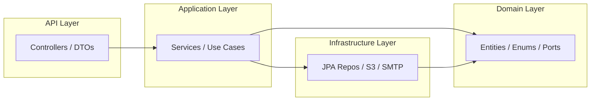

# AAA S.A.S. — Inmobiliaria API

Backend de la plataforma inmobiliaria de AAA S.A.S., construido con Java 21 + Spring Boot 3.4.

## Arquitectura

Monolito modular con principios de Arquitectura Hexagonal (puertos y adaptadores).



## Módulos

| Módulo | Descripción |
|--------|-------------|
| `auth` | Login, refresh, logout, cambio de contraseña |
| `user` | Gestión de usuarios administrativos |
| `company` | Información corporativa y equipo |
| `project` | Proyectos inmobiliarios (CRUD + público) |
| `property` | Inmuebles/unidades dentro de proyectos |
| `lead` | Formularios de contacto y CRM básico |
| `media` | Archivos e imágenes (S3/Supabase) |
| `location` | Catálogos de departamentos y ciudades |
| `notification` | Envío de emails (SMTP) |
| `security` | JWT, filtros, autorización |

## Requisitos

- Java 21
- Docker & Docker Compose
- Maven 3.9+

## Configuración Local

```bash
# 1. Levantar PostgreSQL
cd backend
docker compose up -d

# 2. Copiar variables de entorno
cp .env.example .env
# Editar .env con tus valores

# 3. Ejecutar la aplicación
./mvnw spring-boot:run -Dspring-boot.run.profiles=local

# 4. Abrir Swagger
open http://localhost:8080/swagger-ui.html
```

## Tests

```bash
# Tests unitarios + integración con Testcontainers
./mvnw verify

# Solo tests unitarios
./mvnw test

# Reporte de cobertura (JaCoCo)
open target/site/jacoco/index.html
```

## Despliegue en Render

1. Conectar el repositorio en Render
2. Crear un nuevo Blueprint usando `render.yaml` en la raíz
3. Configurar las variables de entorno en el dashboard
4. El despliegue se ejecuta automáticamente

## Variables de Entorno

Ver `.env.example` para la lista completa.

## Endpoints Principales

### Públicos (sin autenticación)
- `GET /api/v1/public/projects` — Proyectos publicados (paginado + filtros)
- `GET /api/v1/public/projects/{slug}` — Detalle de proyecto
- `GET /api/v1/public/projects/featured` — Proyectos destacados
- `GET /api/v1/public/company` — Información corporativa
- `GET /api/v1/public/properties?projectId=` — Inmuebles por proyecto
- `POST /api/v1/public/leads` — Enviar formulario de contacto
- `GET /api/v1/public/locations/departments` — Departamentos
- `GET /api/v1/public/locations/cities` — Ciudades

### Autenticación
- `POST /api/v1/auth/login` — Iniciar sesión
- `POST /api/v1/auth/refresh` — Renovar tokens
- `POST /api/v1/auth/logout` — Cerrar sesión
- `POST /api/v1/auth/change-password` — Cambiar contraseña

### Administrativos (JWT requerido)
- `CRUD /api/v1/admin/projects` — Gestión de proyectos
- `CRUD /api/v1/admin/properties` — Gestión de inmuebles
- `CRUD /api/v1/admin/users` — Gestión de usuarios (SUPER_ADMIN)
- `GET /api/v1/admin/leads` — Listado de leads
- `POST /api/v1/admin/media` — Subida de archivos

## Stack Tecnológico

- **Java 21** + **Spring Boot 3.4**
- **PostgreSQL 16** + **Flyway** (migraciones)
- **Spring Security 6** + **JWT** (jjwt)
- **Spring Data JPA** + **Hibernate** (modo validate)
- **Caffeine** (caché en memoria)
- **AWS S3** / **Supabase Storage** (archivos)
- **springdoc-openapi** (Swagger UI)
- **Testcontainers** (tests de integración)
- **JaCoCo** (cobertura de código)
- **MapStruct** (mapeo de DTOs)
- **Virtual Threads** (Java 21)
