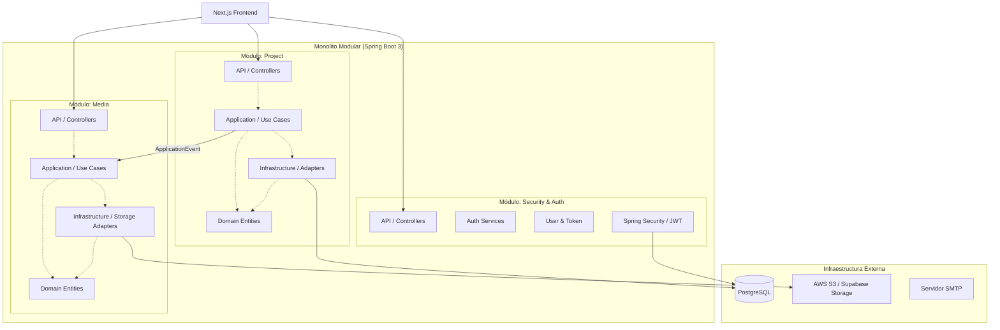

# Arquitectura del Backend - Grupo AAA

## 1. Diagrama de Arquitectura (Monolito Modular)

## 2. Decisiones Técnicas Clave (ADR)

1. **Monolito Modular vs Microservicios:** Se opta por un monolito modular porque reduce la complejidad operativa en etapas tempranas y ahorra costos, pero mantiene las fronteras lógicas para una futura extracción.
2. **Virtual Threads (Java 21):** Se habilitarán en Spring Boot 3.2+ (`spring.threads.virtual.enabled=true`). Esto elimina la necesidad de pools de hilos pesados para tareas I/O (llamadas a la BD, S3 o SMTP).
3. **Paginación y Filtros (JPA Specifications):** Se usarán JPA Specifications en lugar de QueryDSL para no introducir dependencias extra de generación de código.
4. **Relaciones Polimórficas (Media):** En lugar de tener una tabla de imágenes por cada entidad, se usa `MediaFile` con `entity_type` y `entity_id`. Esto simplifica drásticamente el módulo `media`.
5. **Caché (Caffeine):** Se usará Caffeine en memoria para los endpoints públicos (`/public/projects`).
6. **Manejo de Errores (RFC 7807):** Spring Boot 3 soporta nativamente `ProblemDetail`. Lo extenderemos para incluir campos de validación (`invalid_params`).
