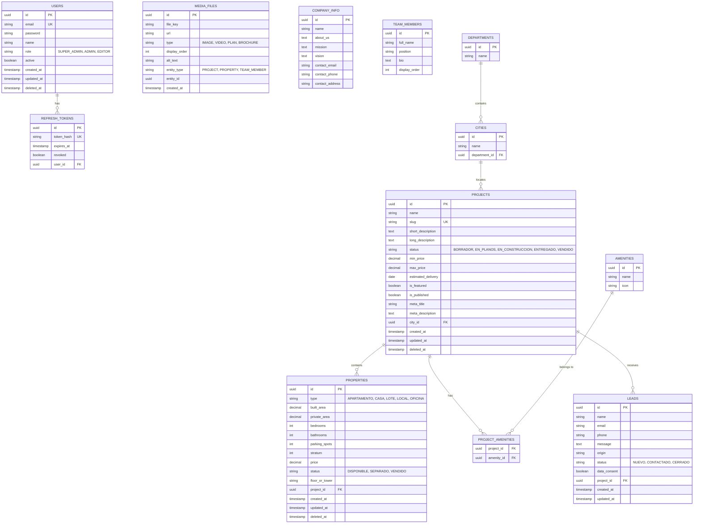

# Modelo Entidad-Relación

```mermaid
erDiagram
    USERS {
        uuid id PK
        string email UK
        string password
        string name
        string role "SUPER_ADMIN, ADMIN, EDITOR"
        boolean active
        timestamp created_at
        timestamp updated_at
        timestamp deleted_at
    }

    REFRESH_TOKENS {
        uuid id PK
        string token_hash UK
        timestamp expires_at
        boolean revoked
        uuid user_id FK
    }

    PROJECTS {
        uuid id PK
        string name
        string slug UK
        text short_description
        text long_description
        string status "BORRADOR, EN_PLANOS, EN_CONSTRUCCION, ENTREGADO, VENDIDO"
        decimal min_price
        decimal max_price
        date estimated_delivery
        boolean is_featured
        boolean is_published
        string meta_title
        text meta_description
        uuid city_id FK
        timestamp created_at
        timestamp updated_at
        timestamp deleted_at
    }

    PROPERTIES {
        uuid id PK
        string type "APARTAMENTO, CASA, LOTE, LOCAL, OFICINA"
        decimal built_area
        decimal private_area
        int bedrooms
        int bathrooms
        int parking_spots
        int stratum
        decimal price
        string status "DISPONIBLE, SEPARADO, VENDIDO"
        string floor_or_tower
        uuid project_id FK
        timestamp created_at
        timestamp updated_at
        timestamp deleted_at
    }

    AMENITIES {
        uuid id PK
        string name
        string icon
    }

    PROJECT_AMENITIES {
        uuid project_id FK
        uuid amenity_id FK
    }

    MEDIA_FILES {
        uuid id PK
        string file_key
        string url
        string type "IMAGE, VIDEO, PLAN, BROCHURE"
        int display_order
        string alt_text
        string entity_type "PROJECT, PROPERTY, TEAM_MEMBER"
        uuid entity_id
        timestamp created_at
    }

    LEADS {
        uuid id PK
        string name
        string email
        string phone
        text message
        string origin
        string status "NUEVO, CONTACTADO, CERRADO"
        boolean data_consent
        uuid project_id FK
        timestamp created_at
        timestamp updated_at
    }

    COMPANY_INFO {
        uuid id PK
        string name
        text about_us
        text mission
        text vision
        string contact_email
        string contact_phone
        string contact_address
    }

    TEAM_MEMBERS {
        uuid id PK
        string full_name
        string position
        text bio
        int display_order
    }

    CITIES {
        uuid id PK
        string name
        uuid department_id FK
    }

    DEPARTMENTS {
        uuid id PK
        string name
    }

    USERS ||--o{ REFRESH_TOKENS : "has"
    PROJECTS ||--o{ PROPERTIES : "contains"
    PROJECTS ||--o{ PROJECT_AMENITIES : "has"
    AMENITIES ||--o{ PROJECT_AMENITIES : "belongs to"
    PROJECTS ||--o{ LEADS : "receives"
    CITIES ||--o{ PROJECTS : "locates"
    DEPARTMENTS ||--o{ CITIES : "contains"
```
